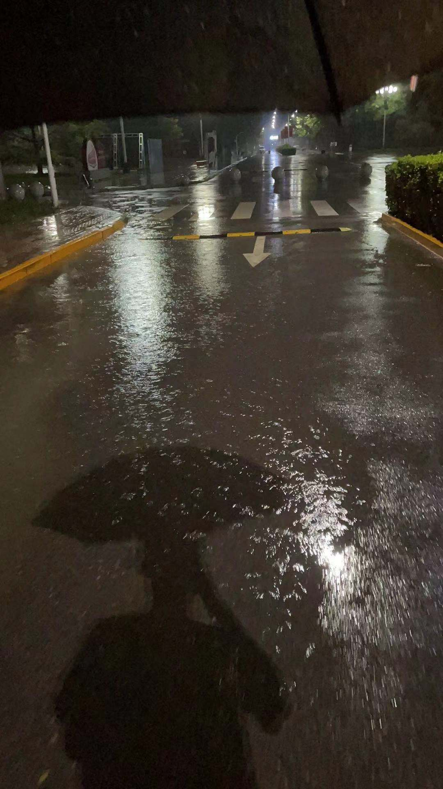
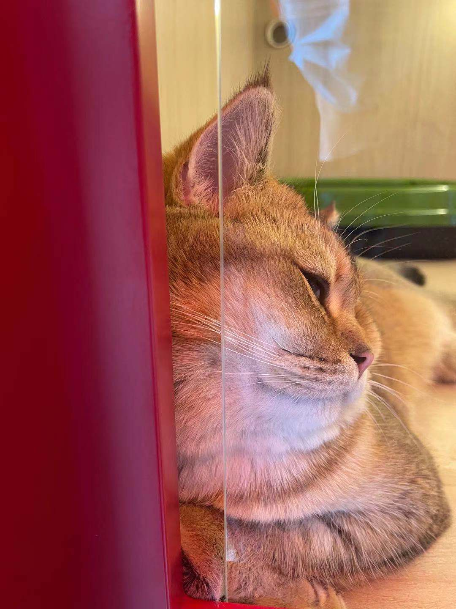

​		昨天舍友说研二开学还没一起吃顿饭，加上北京疫情在学校闷了太久，想出去玩玩，晚上在回龙观和三个舍友还有同实验室的两个师姐一起去唱会歌，十点多还没唱完导师发消息说，准时收拾一下明天去济南出差，可能要去很久。

<!--more-->

​		明天离校去济南了，上午洗洗衣服，吃完午饭睡不着也不想学什么了，想想这几个月感觉过得好快。

​		五月份在西二旗软件园找了个实习，干了不到两个月，导师说可能要搞项目，我就提了辞职赶紧回了学校，一直到现在九月份一直没什么消息，我也没再找实习(不过真的好想出去找点实习)，七中旬趁着没事回了趟家，到月底回去顺路在天津和在渤海银行上班的师兄吃了顿饭（银行香，我也知道香，我还是想去互联网打工hh），回不去北京就去石家庄朋友哪里了，感觉没什么事，也不写论文，就简单把两个月的实习总结一下，买了本刘强的新书<构建企业级推荐系统>，看了快一半，感觉只看书有点空，就找了几个demo敲敲,无聊了就写几个leetocde，写写博客，还学了做几个新菜。除了晚上可能会去元南公园跑会步，其他时间都宅在屋里了，不知不觉就过了一个月。月底回了学校，搞了台主机，搭了个lamda架构的集群，调配置，搞网络，定时任务，用spark的mlib跑了几个之前的模型，回来第一周基本上都是搞这些玩意了，边搞边写了个笔记，写的很乱也没发到博客，每天回去的也玩，有点累。

​		第二周周二开完会，又催了催论文开题的事，晚上有告诉我明天去济南，实习的事今年是没希望了，不搞了，把主机硬盘拆了放抽屉里，扔了一边去了。第二天中国电信给我打电话让我去面试，我一楞，五月份投的简历，9月份才联系，还在临走前一天，奇奇怪怪。实验室七月份走了四个师兄，现在还有两个在外实习，实验室冷冷清清都快没人了，这次去济南两个， 研究所都快要黄了。不说了，晚上临走和师门吃个饭，收拾收拾明天走了，希望一切顺利。

