# 分布式光伏并网数据处理与辅助决策技术研究

（原创文章，未经运行不可转载）

当前，“碳中和”已经成为全球共识，光伏作为几大清洁能源之一，已经成为“碳中和”的主力。随着光伏产业技术的进步和一系列的政策推出，分布式光伏的装机容量也越来越高，并已开始大规模并入配电网，且开始通过各种融合终端设备接入到区域能源互联网系统，并网后数据爆发式增长。同时对分布式光伏电站的有效管理与监测。受各种环境因素的限制，光伏发电本身具有不稳定性，大规模并网会对电力系统的继电保护，电能质量，稳定性等带来很大的影响。

​      在这一特定背景下，对分布式光伏进行有效的监测管理显得尤为重要，对光伏发电的功率与负荷进行准确的预测不仅能辅助电网调度系统合理调整和优化发电计划，改善电网调峰能力，也能降低光伏弃光率，是产业真正实现降本增效的基础

**当前面临问题：**
1.如何高效的收集、处理、存储这些数据。
2.如何更好的利用这些数据，对分布式光伏进行发电功率的预测。

**研究内容**
    1.基于Hadoop的分布式光伏大数据采集与存储研究
	实现光伏数据的实时采集，处理，存储以及可视化，能够在线监测分布式光伏动态数据，
	具备故障告警等功能。
    2.基于DeepFM&LSTM的分布式光伏的发电功率预测研究
	基于海量并网数据与相关深度学习算法，充分发挥分布式光伏电站历史数据在光伏功率
	预测问题中的作用，实现对分布式光伏发电功率的准确预测。

<!--more-->

CODE: [pv_model: 基于CNN+LSTM+attention的分布式光伏预测 (gitee.com)](https://gitee.com/z_saisai/pv_model) 

# 1 - 需求分析

## 1.1 - 数据存储

​				可视化部分需要一段时间的数据，需要将数据做持久化处理。

## 1.2 - 数据可视化

​			每个台区的用户接入数量，总功率，占比等

​			各市的热力图对比

​			环保指数

# 2 - 开发准备

**设备信息**：DELL-3640台式工作站（两台）

**设备参数**： CPU:  i9-11900K

​					RAM: 64GB

​					HDD: 512SSD+2T 机械

**系统信息**：Centos-7.9-2009-64bit , Windows10企业版-LTSC-2019-64bit

# 3. 系统设计

## 3.1 - 系统架构设计


注：

1.  web接口为准实时数据，五分钟更新一次响应内容。
2.  数据库包含部分静态数据，更新频率较低。

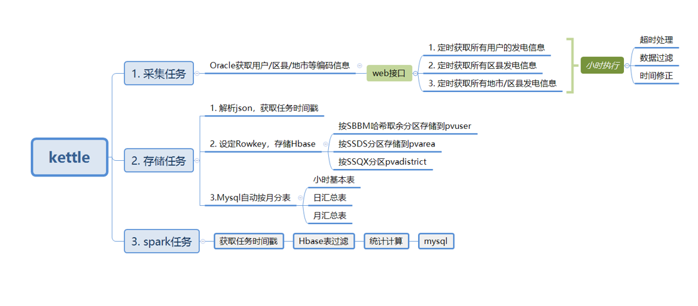

# 4 - 数据开发流程

​		数据采集使用kettle组件，对接口和数据库进行采集与同步，受限于接口的响应效率，同一时刻的数据用户不能同时得到相应，只能取一段时间内的响应内容进行存储（在晚上光伏不工作，影响较小，可以取晚上一段时间的数据作为当天的用户统计）。接口二地市数量较少，可以再短时间内完成所有请求。由于服务器不能入网，将采集与存储拆为两个过程来处理。

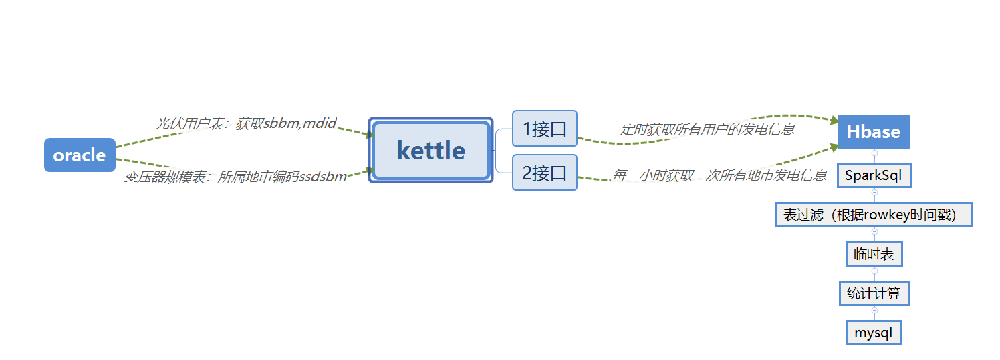

## 4.1 -  数据采集 

**接口一**


接口一数据返回类型：

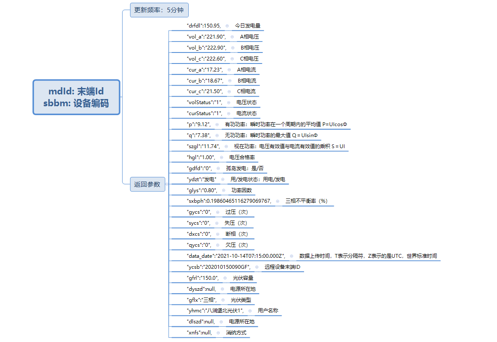

查询的前提是到数据库中获取用户的 mdid 和 sbbm ,通过Url和

**接口二**

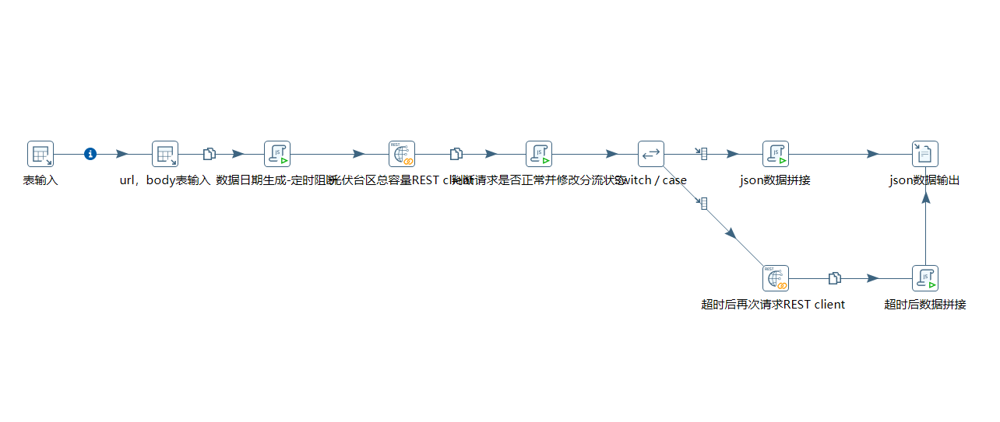


两个接口的存储方式相同，主要区别只是数据库与Rowkey设计不同。

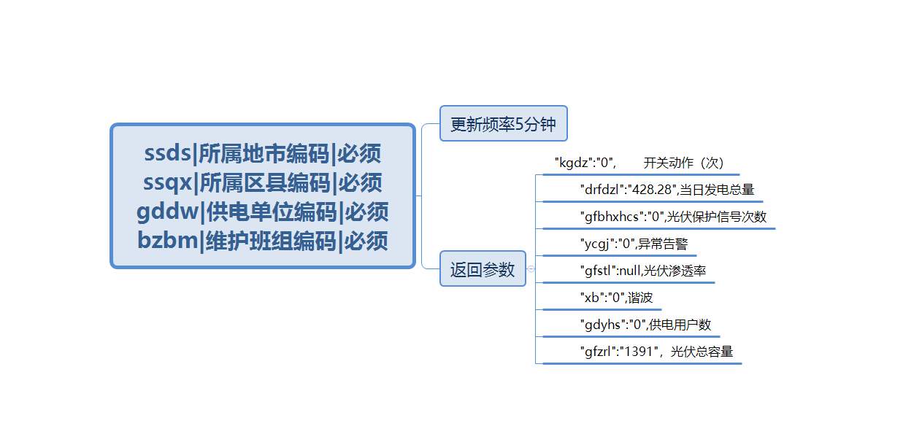

## 4.2 -  数据存储 

### 4.2.1 - Hbase

光伏数据的特征为重复性高，空数据较多，非结构化存储可以降低数据冗余，数据库的设计模式也较容易随以后的业务需求进行改动。这里Hbase的作用较为关键，是数据落地的第一站，需要合理的数据库设计，来优化数据的写入速度和查询效率。

**接口1**

入参与响应内容:

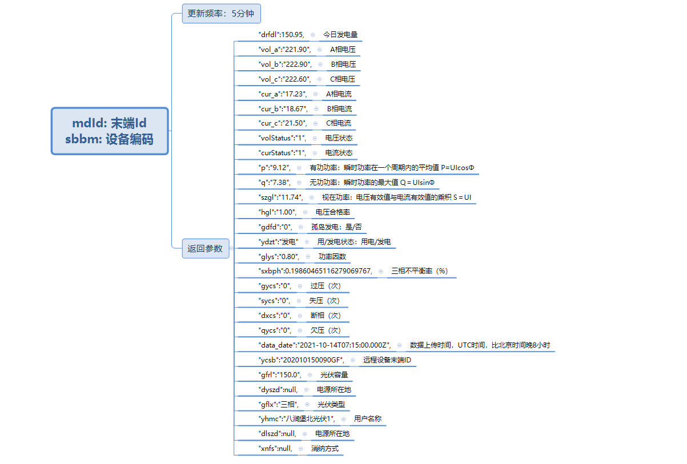

​		对于接口一，业务需求设计以下计算是基于最新时间戳，按 sbbm 分区，求各个台区的用户数，发电量，光伏容量等。每次写入库与查询的数据都包含所有台区的sbbm，所以应该让 sbbm 分布在数据库的各个分区，使得各个分区负载较为均衡，提高读写效率，考虑到sbbm字段编码较长，可以采用对 sbbm 进行哈希在进行取余。即 rowkey 字段的设计可以采用 hash(sbbm) + 时间戳 + sbbm + mdid 方式。

表结构如下,分区长度为1，对应hash(sbbm),分区为0-9，各个分区区间为左闭右开，共十个分区。

```sql
create 'pvuser',{
NAME => 'info',
CONFIGURATION => {'SPLIT_ POLICY' => 'org.apache.hadoop.hbase.regionserver.KeyPrefixRegionSplitPolicy','KeyPrefixRegionSplitPolicy.prefix_ length' => '1'}},
SPLITS => ['1','2','3','4','5','6','7','8','9']
```


**接口2**

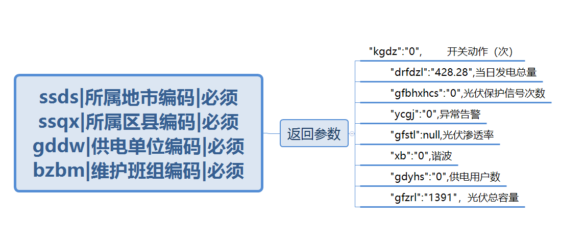

**Rowkey格式**: ssds + 时间戳 

**建表分区**：17个分区 17个城市   如: 37403|1635211102

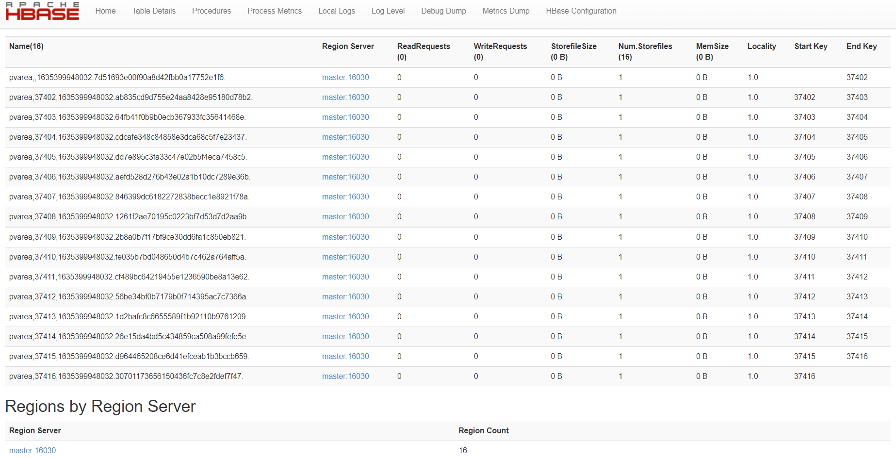

### 4.2.2 - Mysql

**接口1**

计算的结果，增量存储到mysql数据库中，其中主键设为sbbm+时间戳的形式。时间戳包含年月日。

**接口2**

主键同样采用ssds + 时间戳的形式。方便对历史数据与变化趋势进行查询可视化。

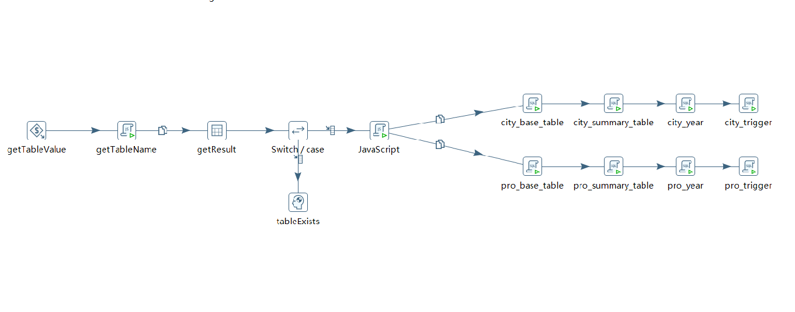


​       每月分表存储采集数据，spark统一计算后在mysql入库之前，统一判断下个月表是否存在，不存在则创建新表和表关联触发器，触发器实现计算日表累计发电量,co2,so2等数据计算及年表数据计算，存储采集数据。

## 4.3 -  数据计算 

​	


​       ETL模块定时处理后的数据都包含每次采集任务的数据时间戳范围，该时间戳不仅用于后续Hbase存储的Rowkey，也会传给每个Spark计算任务，Spark通过时间戳，可以精准快速的从Hbase中获取每次计算所需要的所有RDD数据，经过字段筛选与业务需要再过滤，转换为Dataframe映射为基于内存的临时表，使得后续的计算更加快速。计算结果的存储也包含对应的时间戳，方便可视化模块的定点或定区间的调用。

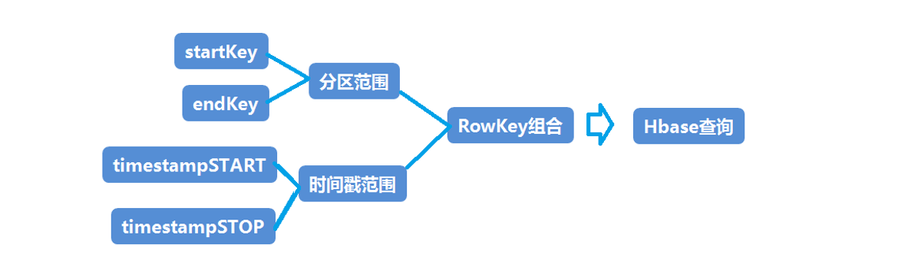

在查询数据时，先查找内存，如果内存中有当前键对应的数据，获取数据直接返回。
如果没有在内存中找到数据，就去查找region对应的hfile，通过索引找到对应的Data Block，将数据送回内存组装，最终将多个hfile中获取到的数据进行合并，然后返回最新版本的数据。

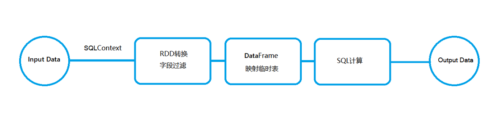

SparkSql将SQLText解析成语法树，获取RDD格式的数据，通过map操作来进行数据字段转换与过滤，并转换为Dataframe映射成基于内存的高效TempView，持久化在内存中，一系列计算完成后才会释放，计算结果分类存储到对应的Mysql中。

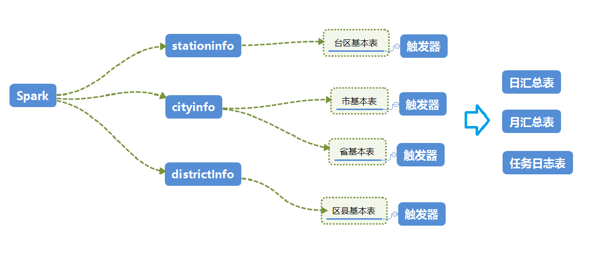

​       Spark任务的计算结果分为四个基本表进行存储，每个表建有触发器，来生成对应的日，月表的汇总信息。任务的执行情况与表的数据修改也会在日志表中生成。

## 4.4 - 任务自动化

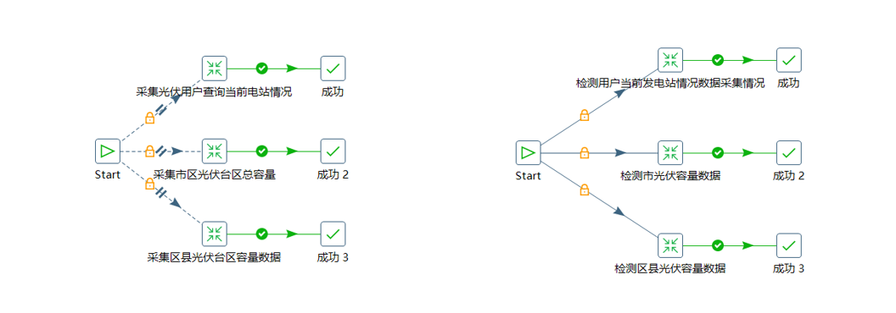

 Kettle创建作业定时采集光伏用户查询当前电站情况，市区光伏台区总容量及区县光伏台区总数量数据；每日23：30分对数据进行检测，每日最后23点数据不完整或不存在情况，对数据进行补录。

# 5 - 功率预测

为充分发挥分布式光伏电站历史数据在光伏功率预测问题中的作用，本文提出了一种基于深度&因子分解机框架下融合长短时记忆网络的分布式光伏电站功率预测模型。通过加入多种设备编码特征来构建更全面的电站设备画像，并使用嵌入式降维来解决海量的稀疏特征。在此基础上，进行特征的组合与筛选，对原始数据进行了充分的特征挖掘。以山东某区域的分布式光伏电站为例，在TensorFlow框架下通过对比验证了所提模型对分布式光伏以及新加入的电站的功率预测效果。

## 5.1 - 构建设备画像

要做到对分布式电站的功率准确预测，就需要尽量全面的光伏设备参数等信息。对于一个光伏电站包含的基本信息可以概括为如下几个方面：

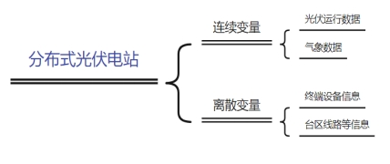 

图1 分布式电站基本信息

光伏发电功率的影响因素有很多，常规的气象数据主要包含：温度、风速、云量、净日照强度、气压、湿度等。光伏设备的主要运行参数包括：装机容量、三相电压/电流、电压合格率、功率因数等。当然除了这些还有光伏设备的厂商、终端编码、台区的设备与线路编码等。这些数据的加入能够让我们的模型更加的“了解”每一个电站，做到在相同气象条件下对每个电站的个性化预测，也能快速泛化与已有电站采用相同设备的新电站，及时获取新电站的发电功率情况。

## 5.2 - DeepFM模型 

DeepFM是华为团队在文献[10]中提出的一种点击率预估模型，适用于多种场景下的特征组合问题，对于多用户的个性化预测问题十分有效。DeepFm主体包含两部分，深度神经网络(Deep Neural Networks, 以下简称DNN) 和因子分解机 (Factorization Machines, 以下简称FM) ，两者分别提供高阶组合特征与低阶组合特征，通过联合训练因子分解机与深度神经网络，就可以让模型抽取到更加丰富的特征。

FM（Factor Machine，因子分解机）算法是文献[11]中提出的一种基于矩阵分解的机器学习算法，其在保留一阶信息的基础上，通过使用求隐向量内积方式来获取二阶交叉特征， 隐向量的方式能够有效解决大规模稀疏数据下训练样本不充分导致模型学习不足的问题。 当然，理论上来讲FM是可以推广到更高阶的，但实际应用因为计算复杂度的原因中并不会那么做，一般只取到二阶，高阶的特征组合我们更倾向于使用深度神经网络来实现。FM模型结构如下图所示 。

  

图2 FM模型结构

由图所示，FM的输入是高纬的稀疏向量与经过Embedding降维后的稠密向量。FM输出结果为：

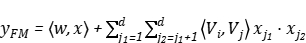    （1）

其中，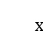代表向量，公式第一部分代表原始稀疏数据的一阶组合，第二部分为稠密向量的二阶交叉组合，两者的和即为FM的输出结果，总的来说，FM 解决的是输入比较稀疏时，组合特征不好学习的问题 ，因为FM引入了隐变量的原因，对于几乎不出现或者很少出现的隐变量，它也可以很好的学习。 

DNN部分与常见的神经网络模型是类似的，但是因为输入的光伏离散数据是稀疏的，所以在具体实现过程中在第一个隐藏层之前也引入嵌入层，通过嵌入层完成稀疏向量到稠密向量的压缩，虽然不同离散变量（或者说不同Field）的特征输入长度不同，但经过嵌入层处理后输出的向量长度均相等。而且值得注意的是，在之前的因子分解机中我们也使用了Embedding来处理输入，这样就可以让DNN与FM使用相同的嵌入层，即嵌入层的权重是两者共享的。

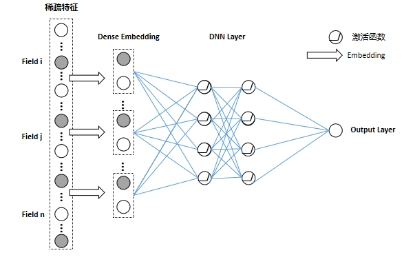 

图3 DNN模型部分

DNN部分模型的输入为：

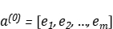 （2）

其中的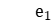就是离散变量Field i对应的Embedding,不同的Field的Embedding拼接后得到一个稠密向量，输入到DNN中，可以表示为：

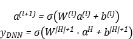 （3）（4）

## 5.3 - LSTM模型

长短时记忆网络（Long Short-Term Memory，简称LSTM） ，是一种特定形式的循环神经网络 （Recurrent neural network，简称RNN），它加入了细胞状态概念，以及对细胞状态进行控制的遗忘门、输入门、输出门，可以在一定程度上解决传统RNN模型的梯度消失与爆炸问题，其神经元结构如图所示。 

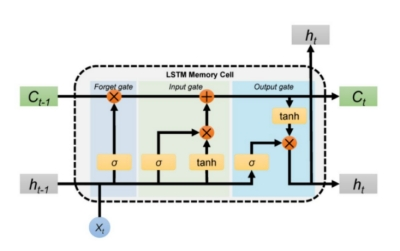 

图4 LSTM神经元结构

该结构中，对细胞状态的信息保留或丢弃量由遗忘门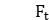通过查看输入门和的信息来决定，而给更新的信息则由输入门  、、通过Tanh层得到的候选细胞状态 决定，更新完细胞状态后RNN单元的最终输出由输出门根据输入门和进行判断。该过程计算公式为： 

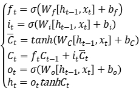  （5）

其中，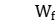 、 、、 和  、 、、 分别为各状态的权重矩阵和偏置矩阵；为sigmoid激活函数。 即得到我们所需要的DeepFM模型的输出：

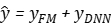 （6）

## 5.4 - 模型融合

当前我们面临的光伏功率预测是一个回归问题，我们需要的是DeepFm输出的高低阶特征组合，DeepFm的输出作为LSTM的输入，以下得到我们需要的模型。

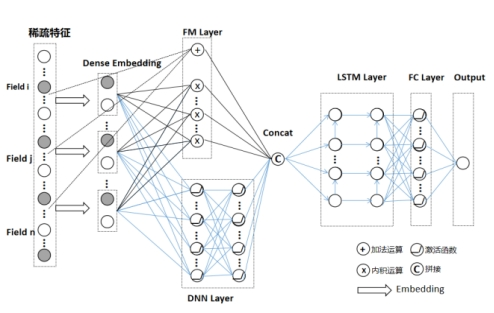 

图5 DeepFm&LSTM模型结构

## 5.5 -  参数设置

本文使用DeepFm结合LSTM的融合模型来预测分布式光伏电站的发电功率，在DeepFm中Deep模型为二层神经网络。神经元个数分别为512，256 。激活函数使用 ReLU 。FM采用二阶交叉，一阶交叉输入原始特征，二阶交叉输入降维稠密特征。选用两层LSTM， 优化器为自适应矩估计Adam，损失函数选用均方差损失，迭代次数设为100。

## 

## 5.6 - 模型评估

上述模型属于预测问题，所以这里选择了均方根误差（RMSE），平均绝对误差（MAE），平均绝对百分误差（MAPE）指标来评价我们的模型的预测结果。对应的公式如下。其中与分别代表预测功率输出与实际功率。

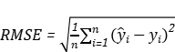   （8）

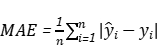   （9）

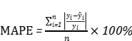   （10）

## 5.7 -  整体流程

经过数据预处理后，将数据集划分为训练集、验证集与测试集，由训练集和验证集进行模型训练和参数优化，将得到的最优模型对测试集进行测试并得到预测结果，模型具体搭建流程如图所示。 

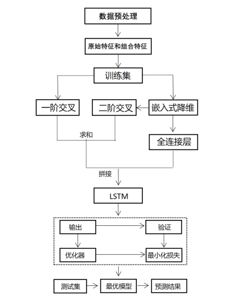 

图7 DeepFm&LSTM模型搭建流程

