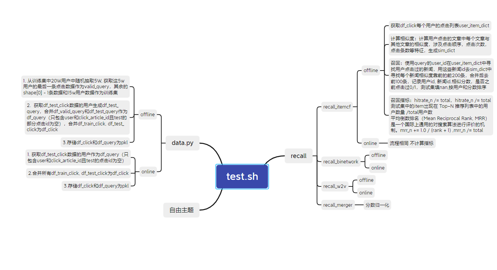
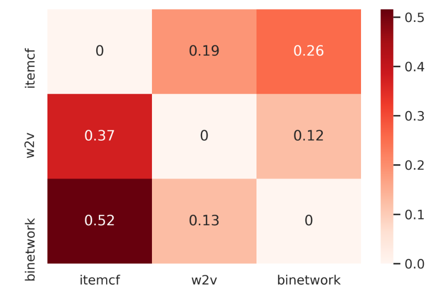

# 推荐系统新闻推荐正式赛

 赛题以新闻APP中的新闻推荐为背景，要求选手根据用户历史浏览点击新闻文章的数据信息预测用户未来点击行为，即用户的最后一次点击的新闻文章，测试集对最后一次点击行为进行了剔除。 

<!--more-->

# 背景

 赛题以预测用户未来点击新闻文章为任务，数据集报名后可见并可下载，该数据来自某新闻APP平台的用户交互数据，包括30万用户，近300万次点击，共36万多篇不同的新闻文章，同时每篇新闻文章有对应的embedding向量表示。为了保证比赛的公平性，将会从中抽取20万用户的点击日志数据作为训练集，5万用户的点击日志数据作为测试集A，5万用户的点击日志数据作为测试集B。 

# 整体方案

code:

 为了构造稳定的线下验证，从训练集用户中随机采样5w个用户作为作为线下验证集用户，将验证集用户的最后一次点击记录从原训练集的点击日志中剔除。合并这时候的训练集点击日志和测试集点击日志作为总的历史点击记录，预测验证集用户的最后一次点击作为线下验证，实验证明该验证方式很稳定，和线上指标同增同减且相差不大。 

# 召回

## itemcf

原始的 itemcf 将用户点击过的新闻看做一个无序的集合，但在实际应用中，应该考虑点击次序带来的影响。在计算同一序列中两个新闻的相似度时，不仅需要考虑共现次数，也需要考虑两个新闻之间的次序关系。同一点击序列中两个新闻位置越远，相关性应该减小。新闻对顺序和逆序的权重也不同，在点击序列A，B，C中，”BC”这样的正序权重应该大于”BA”这样的逆序权重。更多关于 itemcf 的改进可以看之前 KDD CUP 的相关方案总结。

> 日志中所有出现过的新闻只有3w多个，而整个新闻库中却有30多万。用户可能会点击一些没有在日志数据中出现的新闻。从线下验证集来看，大概有12%待预测新闻没有出现在历史点击记录里。为了缓解冷启动问题，在计算新闻相似度的时候可以考虑加入内容相似度。但是基于数据集给的新闻 embedding 向量表示做向量召回的效果很差劲，所以最后在 itemcf 中没有引入新闻的内容相似度。

建立新闻的相似度关系后，进入到召回阶段，根据用户的历史点击新闻，结合相似度选择 TOP100 关联新闻。选取关联新闻时，除了考虑和历史点击新闻的相似度，还要加入位置距离衰减。新闻点击是强热点相关，所以历史点击新闻对下一次点击预测的影响传播不会太远。在实际测试中，利用所有历史点击新闻做召回，hitrate_5 指标只有0.20，限定只用最近点击的两个新闻来做召回的话，可以大幅提升至0.33。

## 基于网络关系的召回

该方法源自”Bipartite network projection and personal recommendation”，代码采用自[论坛开源](https://tianchi.aliyun.com/forum/postDetail?postId=104936)。该方法也分为两个阶段，新闻相似度计算和基于用户点击历史的新闻召回。在相似度计算阶段，通过用户将两个新闻连接起来。计算相似度时考虑两种因素：1)两个新闻的共同被点击用户过多，则相似度减少；2)共同被点击用户的点击新闻过多，相似度也要减少。基于用户点击历史的新闻召回和 itemcf 类似，不再赘述。类似地，在召回时只利用了最新一次点击的新闻做召回，相较于利用全量历史记录召回，效果提高了10%。

## w2v 向量召回

除了使用人工规则从序列中提取相似度，我们还可以使用序列学习模型 Word2Vec 为新闻学习向量表示。将用户的新闻点击序列作为句子喂到 Word2Vec 模型，然后选取和用户最近点击新闻最相似的关联新闻。向量学习和寻找相似全部使用 gensim 库的 Word2Vec 实现。

## 召回合并

多路召回之间肯定存在重复召回的情况，这也是为什么召回策略讲究差异性，其实就是为了减少重复召回的数量。利用重复召回的新闻数量占该路召回数量之比做相似度参考，3路召回的相似度见热力图。

图1 召回方式相似度

重复被召回的新闻在多个召回方式中的得分是不一样的，得分是排序时的强特，需要进行得分合并。对各个召回结果，以用户为单位进行最大最小归一化。分数合并测试了sum，mean和max，效果对比见下表。max丢失的消息较多，mean对重复次数多的新闻不公平。

| 合并方式 | hitrate_5           |
| -------- | ------------------- |
| sum      | 0.3700630930498286  |
| mean     | 0.33700134134830345 |
| max      | 0.35155745441899744 |

去重之后，平均每个用户召回到153个新闻。删除没有召回到真实点击的验证集用户，减少了无用负样本的数量，也提高了后续排序模型的效果，但是在计算线下指标的时候这部分用户的数量要包括进去，否则指标会虚高。合并前后各召回方式指标如下表所示：

|           | hitrate_5           | mrr_5               |
| --------- | ------------------- | ------------------- |
| itemcf    | 0.33628098762978786 | 0.19792256611521228 |
| binetwork | 0.3127825525361419  | 0.19114627320448885 |
| w2v       | 0.15706195041979235 | 0.08342813850663192 |
| 合并      | 0.3667842416414129  | 0.2195861692085987  |

# 排序

本方案把排序建模为二分类任务，分为特征工程和二分类模型预测两部分。特征工程主要围绕召回策略进行，保证实时性召回的新闻能在排序阶段被推出去。模型采用 LGB 模型。

## 特征工程

特征工程分为3类：新闻特征，用户特征，用户-新闻交互特征。数据集本身给出的属性信息较少，所以特征工程主要围绕交互属性展开。

新闻特征包括：

- 新闻字数
- 新闻创建时间
- 新闻被阅读数量

用户特征包括：

- 用户点击新闻的创建时间差的平均值
- 用户点击新闻的点击时间差的平均值
- 用户点击新闻的点击-创建时间差的统计值：mean，std
- 用户点击新闻的 click_datetime_hour 统计值
- 用户点击新闻的字数统计值
- 用户点击新闻的创建时间统计值
- 用户点击新闻的点击时间统计值
- 用户新闻阅读数量
- 用户某种类新闻阅读数量

交互特征主要基于之前的召回策略进行，通过保存召回阶段的新闻相似度信息或向量，我们能够间接或直接得到用户对待预测新闻的评分。基于 itemcf， 网络关系和 w2v 的召回得到的只是新闻之间的相似度，需要和用户的历史点击新闻计算间接得到用户-新闻评分，采用如下方式：

- 待预测新闻和用户所有历史点击新闻相似度按次序加权求和
- 待预测新闻和用户最近一次点击新闻相似度

## 模型

模型采用单模 LGB 进行预测，特征重要性见下表。排序之后，hitrate_5 涨到0.4394406080778976，mrr_5 涨到0.26552279464123835。

| feature_name                                  | gain          |
| --------------------------------------------- | ------------- |
| sim_score                                     | 557646.594097 |
| user_last_click_timestamp_diff                | 192108.389757 |
| user_last_click_article_itemcf_sim            | 124281.856153 |
| user_last_click_article_w2v_sim               | 73809.001815  |
| user_clicked_article_itemcf_sim_sum           | 65907.806015  |
| article_id_cnt                                | 65031.067219  |
| user_last_click_created_at_ts_diff            | 53308.117885  |
| user_last_click_article_binetwork_sim         | 35544.272514  |
| user_click_article_w2w_sim_sum_2              | 22115.916349  |
| user_click_timestamp_created_at_ts_diff_mean  | 20967.278802  |
| user_click_timestamp_created_at_ts_diff_std   | 19246.184266  |
| article_id                                    | 19177.854082  |
| words_count                                   | 18412.732866  |
| user_click_last_article_click_time            | 17445.728666  |
| user_click_datetime_hour_std                  | 17065.241513  |
| user_id_category_id_cnt                       | 16947.363850  |
| created_at_ts                                 | 16833.830176  |
| user_last_click_words_count_diff              | 16622.374522  |
| user_clicked_article_words_count_mean         | 16606.933470  |
| user_id_click_diff_mean                       | 15513.968470  |
| user_id_click_article_created_at_ts_diff_mean | 15014.800224  |
| user_id                                       | 14344.929410  |
| user_click_last_article_words_count           | 14080.826424  |
| user_clicked_article_click_time_mean          | 13204.633566  |
| user_click_last_article_created_time          | 10290.474666  |
| user_clicked_article_created_time_max         | 9965.635575   |
| user_id_cnt                                   | 8507.025577   |
| category_id                                   | 6201.554409   |