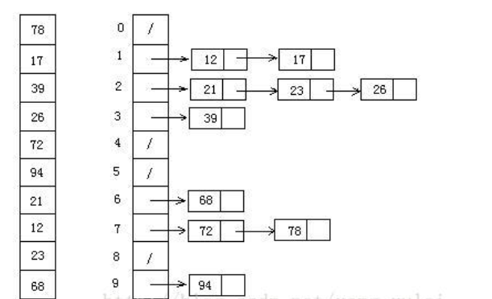

# 排序算法总结

#### 算法分类

十种常见排序算法可以分为两大类：

- **比较类排序**：通过比较来决定元素间的相对次序，由于其时间复杂度不能突破O(nlogn)，因此也称为非线性时间比较类排序。
- **非比较类排序**：不通过比较来决定元素间的相对次序，它可以突破基于比较排序的时间下界，以线性时间运行，因此也称为线性时间非比较类排序。

<!-- more -->


#### 算法复杂度


**相关概念**

- **稳定**：如果a原本在b前面，而a=b，排序之后a仍然在b的前面。
- **不稳定**：如果a原本在b的前面，而a=b，排序之后 a 可能会出现在 b 的后面。
- **时间复杂度**：对排序数据的总的操作次数。反映当n变化时，操作次数呈现什么规律。
- **空间复杂度：**是指算法在计算机内执行时所需存储空间的度量，它也是数据规模n的函数。

### 1、冒泡排序（Bubble Sort）

 冒泡排序是一种简单的排序算法。它重复地走访过要排序的数列，一次比较两个元素，如果它们的顺序错误就把它们交换过来。走访数列的工作是重复地进行直到没有再需要交换，也就是说该数列已经排序完成。**这个算法的名字由来是因为越小的元素会经由交换慢慢“浮”到数列的顶端**。 


```python
    def bubbleSort(self,nums):
        '''
        1.比较相邻的元素。如果第一个比第二个大，就交换它们两个；
        2.对每一对相邻元素作同样的工作，从开始第一对到结尾的最后一对，这样在最后的元素应该会是最大的数；
        3.针对所有的元素重复以上的步骤，除了最后一个；
        4.重复步骤1~3，直到排序完成。
        '''
        for i in range(len(nums)):
            for j in range(len(nums)-1-i):
                if nums[j] > nums[j+1]:
                    nums[j], nums[j+1] = nums[j+1], nums[j]
        return nums
```

### 2、选择排序（Selection Sort）

选择排序(Selection-sort)是一种简单直观的排序算法。它的工作原理：首先在未排序序列中找到最小（大）元素，存放到排序序列的起始位置，然后，再从剩余未排序元素中继续寻找最小（大）元素，然后放到已排序序列的末尾。以此类推，直到所有元素均排序完毕。 


表现最稳定的排序算法之一，因为无论什么数据进去都是O(n2)的时间复杂度，所以用到它的时候，数据规模越小越好。唯一的好处可能就是不占用额外的内存空间了吧。理论上讲，选择排序可能也是平时排序一般人想到的最多的排序方法了吧。

```python
    def selectionSort(self,nums):
        '''
        n个记录的直接选择排序可经过n-1趟直接选择排序得到有序结果。具体算法描述如下：
        初始状态：无序区为R[1..n]，有序区为空；
        第i趟排序(i=1,2,3…n-1)开始时，当前有序区和无序区分别为R[1..i-1]和R(i..n）。
        该趟排序从当前无序区中-选出关键字最小的记录 R[k]，将它与无序区的第1个记录R交换，
        使R[1..i]和R[i+1..n)分别变为记录个数增加1个的新有序区和记录个数减少1个的新无序区；
        n-1趟结束，数组有序化了。
        '''

        for i in range(len(nums)):
            min_num = nums[i]
            min_index = i
            for j in range(i,len(nums)):
                if nums[j]<min_num:
                    min_num = nums[j]
                    min_index = j
            nums[i], nums[min_index] = nums[min_index], nums[i]
        return nums
```

### 3、插入排序（Insertion Sort）

插入排序（Insertion-Sort）的算法描述是一种简单直观的排序算法。它的工作原理是通过构建有序序列，对于未排序数据，在已排序序列中从后向前扫描，找到相应位置并插入。


插入排序在实现上，通常采用in-place排序（即只需用到O(1)的额外空间的排序），因而在从后向前扫描过程中，需要反复把已排序元素逐步向后挪位，为最新元素提供插入空间。

```python
    def insertionsort(self,nums):
        '''
        从第一个元素开始，该元素可以认为已经被排序；
        取出下一个元素，在已经排序的元素序列中从后向前扫描；
        如果该元素（已排序）大于新元素，将该元素移到下一位置；
        重复步骤3，直到找到已排序的元素小于或者等于新元素的位置；
        将新元素插入到该位置后；
        重复步骤2~5。
        '''
        for i in range(1,len(nums)):
            temp = nums[i]
            while(i -1 >= 0 and temp<nums[i-1]):
                nums[i] = nums[i-1]
                i -= 1
            nums[i] = temp
        return nums
```

### 4、希尔排序（Shell Sort）

1959年Shell发明，第一个突破O(n2)的排序算法，**是简单插入排序的改进版**。它与插入排序的不同之处在于，它会优先比较距离较远的元素。希尔排序又叫**缩小增量排序**。


 希尔排序的核心在于间隔序列的设定。既可以提前设定好间隔序列，也可以动态的定义间隔序列。动态定义间隔序列的算法是《算法（第4版）》的合著者Robert Sedgewick提出的。　 

```python
    def shellSort(self,nums):
        '''
        先将整个待排序的记录序列分割成为若干子序列分别进行直接插入排序，具体算法描述：
        选择一个增量序列t1，t2，…，tk，其中ti>tj，tk=1；
        按增量序列个数k，对序列进行k 趟排序；
        每趟排序，根据对应的增量ti，将待排序列分割成若干长度为m 的子序列，分别对各子表进行直接插入排序。
        仅增量因子为1 时，整个序列作为一个表来处理，表长度即为整个序列的长度。
        '''
        gap = int(len(nums)/2)
        while(gap>0):
            for i in range(gap,len(nums)):
                j = i
                current = nums[i]
                while(j - gap >= 0 and current < nums[j - gap]):
                    nums[j] = nums[j -gap]
                    j -= gap
                nums[j] = current
            gap = int(gap/2)
        return nums
```

### 5、归并排序（Merge Sort）

归并排序是建立在归并操作上的一种有效的排序算法。该算法是采用分治法（Divide and Conquer）的一个非常典型的应用。将已有序的子序列合并，得到完全有序的序列；即先使每个子序列有序，再使子序列段间有序。若将两个有序表合并成一个有序表，称为2-路归并。 


归并排序是一种稳定的排序方法。和选择排序一样，归并排序的性能不受输入数据的影响，但表现比选择排序好的多，因为始终都是O(nlogn）的时间复杂度。代价是需要额外的内存空间。 

```python
    def mergeSort(self,nums):
        '''
        把长度为n的输入序列分成两个长度为n/2的子序列；
        对这两个子序列分别采用归并排序；
        将两个排序好的子序列合并成一个最终的排序序列。
        '''
        if(len(nums)==1):return nums
        mid = int(len(nums)/2)
        left = nums[:mid]
        right = nums[mid:]
        return self.merge(self.mergeSort(left),self.mergeSort(right))
    def merge(self,left,right):
        res = []
        while(len(left)>0 and len(right)>0):
            if left[0] < right[0]:
                res.append(left.pop(0))
            else:
                res.append(right.pop(0))
        while(len(left)>0):
            res.append(left.pop(0))
        while(len(right)>0):
            res.append(right.pop(0))
        return res
```

### 6、快速排序（Quick Sort）

快速排序的基本思想：通过一趟排序将待排记录分隔成独立的两部分，其中一部分记录的关键字均比另一部分的关键字小，则可分别对这两部分记录继续进行排序，以达到整个序列有序。


```python
    def quickSort(self,nums):
        start, end = 0, len(nums)-1
        def quick(nums,start,end):
            if start >= end:
                return# 递归的退出条件
            mid = nums[start]# 设定起始的基准元素
            low = start# low为序列左边在开始位置的由左向右移动的游标
            high = end# high为序列右边末尾位置的由右向左移动的游标
            while low < high:
                # 如果low与high未重合，high(右边)指向的元素大于等于基准元素，则high向左移动
                while low < high and nums[high] >= mid:
                    high -= 1
                nums[low] = nums[high]
                while low < high and nums[low] <= mid:
                    low += 1
                nums[high] = nums[low]
            nums[low] = mid
            quick(nums,start,low-1)
            quick(nums,low+1,end)
        quick(nums,start,end)
        return nums
```

### 7、堆排序（Heap Sort）

堆排序（Heapsort）是指利用堆这种数据结构所设计的一种排序算法。堆积是一个近似完全二叉树的结构，并同时满足堆积的性质：即子结点的键值或索引总是小于（或者大于）它的父节点。

**a.将无需序列构建成一个堆，根据升序降序需求选择大顶堆或小顶堆;**

**b.将堆顶元素与末尾元素交换，将最大元素"沉"到数组末端;**

**c.重新调整结构，使其满足堆定义，然后继续交换堆顶元素与当前末尾元素，反复执行调整+交换步骤，直到整个序列有序。**

```python
    def big_endian(self, arr, start, end):
            root = start#取出当前元素作为根
            child = root * 2 + 1  # 求出其对应的左孩子
            while child <= end:
                # 孩子比最后一个节点还大，也就意味着最后一个叶子节点了，就得跳出去一次循环，已经调整完毕
                if child + 1 <= end and arr[child] < arr[child + 1]:
                    # 为了始终让其跟子元素的较大值比较，如果右边存在且比左边大就左换右，左边大的话就默认
                    child += 1
                if arr[root] < arr[child]:
                    # 父节点小于子节点直接交换位置，同时坐标也得换，这样下次循环while可以准确判断：是否为最底层，
                    # 是不是调整完毕
                    arr[root], arr[child] = arr[child], arr[root]
                    root = child
                    child = root * 2 + 1
                else:
                    #当前元素比左右都大 无需调整 直接跳出
                    break

    def heap_sort(self,arr):  # 大根堆排序
            # 计算最后一个非叶子节点
            first = len(arr) // 2 - 1
            # 1.开始构建大顶堆
            for start in range(first, -1, -1):
                # 从第一个非叶子结点从下至上，从右至左调整结构
                self.big_endian(arr, start, len(arr) - 1)
            # 2.调整堆结构+交换堆顶元素与末尾元素
            for end in range(len(arr) - 1, 0, -1):
                arr[0], arr[end] = arr[end], arr[0]  # 顶部尾部互换位置
                self.big_endian(arr, 0, end - 1)  # 重新调整子节点的顺序，从顶开始调整
            return arr
```

### 8、计数排序（Counting Sort）

计数排序不是基于比较的排序算法，其核心在于将输入的数据值转化为键存储在额外开辟的数组空间中。 作为一种线性时间复杂度的排序，计数排序要求输入的数据必须是有确定范围的整数。

计数排序是一个稳定的排序算法。**当输入的元素是 n 个 0到 k 之间的整数时**，时间复杂度是O(n+k)，空间复杂度也是O(n+k)，**其排序速度快于任何比较排序算法**。当k不是很大并且序列比较集中时，计数排序是一个很有效的排序算法。 

- 创建一个bucket,容量为数组最大数+1个(0-max)
- 统计数组中每个值为出现的次数，存入bucket
- 反向填充数组,从0开始到max,按出现的次数依次存储到数组中


```python
    def countingSort(self,nums):
        bucket = [0]*(max(nums)+1)
        c = 0
        for i in range(len(nums)):
            bucket[nums[i]] += 1
        for j in range(len(bucket)):
            while(bucket[j]>0):
                nums[c] = j
                c += 1
                bucket[j] -= 1
        return nums
```

### 9、桶排序（Bucket Sort）

桶排序是计数排序的升级版。它利用了函数的映射关系，高效与否的关键就在于这个映射函数的确定。桶排序 (Bucket sort)的工作的原理：假设输入数据服从均匀分布，将数据分到有限数量的桶里，每个桶再分别排序（有可能再使用别的排序算法或是以递归方式继续使用桶排序进行排）。



- 设置一个定量的数组当作空桶；
- 遍历输入数据，并且把数据一个一个放到对应的桶里去；
- 对每个不是空的桶进行排序；
- 从不是空的桶里把排好序的数据拼接起来。 

```python
    # 桶排序可以看成是计数排序的升级版,计数排序的一个单位是一个数,而桶排序的一个单位是一个区间
    def bucketSort(self,numList, bucketNum):
        import math
        if len(numList) <= 0:
            return numList

        maxNum = max(numList)
        minNum = min(numList)

        bucketLength = len(numList) - 1
        bucketSize = ((maxNum - minNum) / bucketLength)  # 根据桶的数量找到每个桶的取值范围
        buckets = [[] for i in range(bucketLength)]
        print(buckets)
        for i in range(len(numList)):  # 将各个数分配到各个桶
            # num_bucktes_local界定范围.只要大于第n个桶,就是在第n+1个桶里.所以是向上取整.
            # 比如说 numList = [1,40,50,60,200].
            num_bucktes_local = math.ceil((numList[i] - minNum) / bucketSize) - 1
            if num_bucktes_local <= 0:  # 最小值是 == -1 的.
                num_bucktes_local = 0
            buckets[num_bucktes_local].append(numList[i])

        # ---可删除---
        print('桶的取值范围是:', bucketSize)
        print('每个桶:', buckets)
        # ---可删除---

        for i in range(bucketLength):  # 桶内排序，可以使用各种排序方法
            buckets[i].sort()
        res = []
        for i in range(len(buckets)):  # 分别将各个桶内的数提出来，压入结果
            res.extend(buckets[i])
        return res
```

### 10、基数排序（Radix Sort）

基数排序是按照低位先排序，然后收集；再按照高位排序，然后再收集；依次类推，直到最高位。有时候有些属性是有优先级顺序的，先按低优先级排序，再按高优先级排序。最后的次序就是高优先级高的在前，高优先级相同的低优先级高的在前。


基数排序基于分别排序，分别收集，所以是稳定的。但基数排序的性能比桶排序要略差，每一次关键字的桶分配都需要O(n)的时间复杂度，而且分配之后得到新的关键字序列又需要O(n)的时间复杂度。假如待排数据可以分为d个关键字，则基数排序的时间复杂度将是O(d*2n) ，当然d要远远小于n，因此基本上还是线性级别的。基数排序的空间复杂度为O(n+k)，其中k为桶的数量。一般来说n>>k，因此额外空间需要大概n个左右。

```python
    def radixSort(self,nums):
        pos_list = []
        neg_list = []
        # 将待排序列分为正负两组
        for num in nums:
            if num < 0:
                neg_list.append(num)
            if num >= 0:
                pos_list.append(num)
        def _radixSort(num_list):
            num_digit = 0 # 分桶的位数，0代表个位，1为十位...
            e = min(num_list)if num_list[0] < 0 else max(num_list)# 得到最小/大的数
            while num_digit < len(str(e)):# 分桶位数(从0开始)小于最小/大数的位数
                num_values = [[] for _ in range(10)]# 初始化桶
                # 把待排数按位数分桶
                for num in num_list:
                    num_values[int(num / (10 ** num_digit)) % 10].append(num)
                num_list.clear()
                # 从桶中取出已排的数
                for num_value in num_values:
                    for num in num_value:
                        num_list.append(num)
                #更新位数，进行下一次分桶
                num_digit += 1
            return num_list
        # 按正负，分别排序
        if len(neg_list) != 0:neg_list = _radixSort(neg_list)
        if len(pos_list) != 0:pos_list = _radixSort(pos_list)
        # 组合返回
        return neg_list + pos_list
```